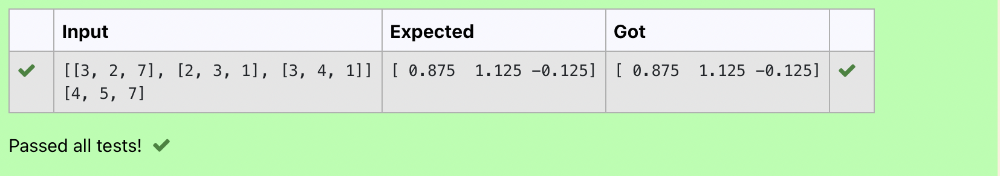
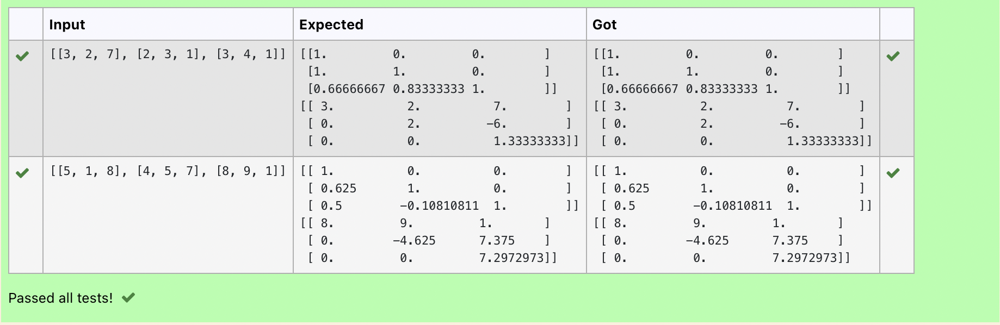

# LU Decomposition without zero on the diagonal

## AIM:
To write a program to find the LU Decomposition of a matrix.

## Equipments Required:
1. Hardware – PCs
2. Anaconda – Python 3.7 Installation / Moodle-Code Runner

## Algorithm
1. Start the program.
2. Import numpy and scipy.linalg
3. Get Input from the user.
4. Find the LU Decomposition.
5. Display the values.
6. Stop the program.

## Program:
~~~
/*
Program to find the LU Decomposition of a matrix.
Developed by: K.SaiEswar
RegisterNumber: 21000679
*/
import numpy as np
from scipy.linalg import lu
A= np.array(eval(input()))
P , L , U =lu(A)
print(L)
print(U)
~~~

## Output:

## Result:
Thus the program to find the LU Decomposition of a matrix is written and verified using python programming.

# LU Decomposition without zero on the diagonal

## AIM:
To write a program to find the LU Decomposition of a matrix.

## Equipments Required:
1. Hardware – PCs
2. Anaconda – Python 3.7 Installation / Moodle-Code Runner

## Algorithm
1. Start the program.
2. Import numpy and scipy.linalg lu_factor , lu_solve
3. Get Input from the user.
4. Find the LU Decomposition.
5. Display the values.
6. Stop the program.

## Program:
~~~
/*
Program to solve a matrix using LU decomposition.
Developed by: K.SaiEswar
RegisterNumber: 21000679
*/
import numpy as np
from scipy.linalg import lu_factor, lu_solve
A= np.array(eval(input()))
B= np.array(eval(input()))
lu , pivot = lu_factor(A)
x=lu_solve((lu,pivot),B)
print(x)
~~~

## Output:

## Result:
Thus the Program to solve a matrix using LU decomposition is written and verified using python programming.

